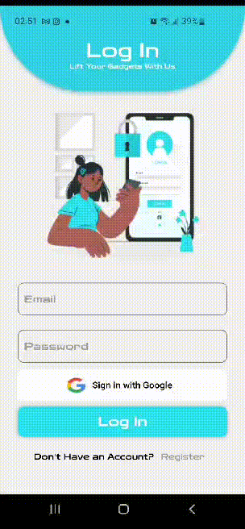
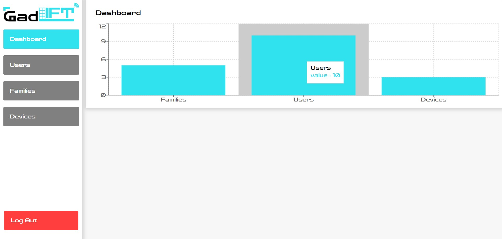

<br><br>

<!-- project philosophy -->


## **GadLift**: Elevating Convenience to New Heights

>Imagine a world where your home gadgets come to you, effortlessly and on-demand. Especially in buildings without elevators, this can be a game-changer. That's where **GadLift** steps in. 

>**GadLift** is an innovative IoT system designed to simplify your life by bringing your home gadgets right to your doorstep. Our mission is to make your life easier, one lift at a time.

## User Stories

### User

- **Effortless Living**: As a user, I want a device that lifts my gadgets to my doorstep, so I can relax and enjoy my home without the heavy lifting.
- **Family Access**: As a user, I want to register family members on the app, enabling everyone in my family to use the device and share in the convenience.
- **App Control**: As a user, I want to call the device using a mobile app, eliminating the need for a physical remote control and making the process seamless.

### Admin

- **User Analytics**: As an admin, I want to see how many users are using the app, enabling me to manage the app's scalability effectively.
- **Device Tracking**: As an admin, I want to see how many devices I have, allowing me to keep track of all active devices.
- **Platform Expansion**: As an admin, I want to add a new device to the platform, helping me monitor the number of active and offline devices.

>
> With **GadLift**, we're not just lifting gadgets - we're elevating your home living experience. Welcome to a world of convenience, welcome to **GadLift**. 🚀

<br><br>

<!-- Tech Stacks -->


###  **GadLift**  is built using the following technologies:

- This project uses the [Flutter app development framework](https://flutter.dev/). Flutter is a cross-platform hybrid app development platform which allows us to use a single codebase for apps on different platforms including mobile, desktop, Linux, Android, IOS,MacOs, Windows and the web.
- The admin panel is done using [React.js](https://react.dev/). React.js is a JavaScript library for building single-page applications out of individual pieces called components.
- To send  notifications, the app uses the [firebase_messaging ](https://pub.dev/packages/firebase_messaging) package which supports Android, iOS.

- For the backend side the project done with [NestJS](https://nestjs.com/)
which is a progressive Node.js framework that helps build server-side applications. Nest extends [Node.js](https://nodejs.org/en) frameworks like Express or Fastify adding modular organization and a wide range of other libraries to take care of repetitive tasks. It’s open-source, uses [TypeScript](https://www.typescriptlang.org/), and it is a very versatile Node.js framework for building backend systems. It helps scale Node.js servers and supports several databases.

- The project uses [MongoDB](https://www.mongodb.com/). Which is an open-source, nonrelational database management system (DBMS) that uses flexible, JSON-like documents instead of traditional tables and rows to process and store various forms of data12. As a NoSQL database solution, MongoDB provides an elastic data storage model that enables users to store and query multivariate data types with ease.

- For the IOT part the project uses [PlatformIO](https://platformio.org/) which is is a professional, cross-platform tool for embedded systems engineers and software developers1. It supports multiple frameworks and is compatible with a wide range of microcontroller boards, including Arduino and other MCU boards.
  
- The app uses the font [Zen Dots](https://fonts.google.com/specimen/Zen+Dots) as its main font, and the design of the app adheres to the material design guidelines.

<br><br>

> We designed GadLift app using wireframes and mockups, iterating on the design until we reached the ideal layout for easy navigation and a seamless user experience.
- Project Figma design [figma](https://www.figma.com/file/fP5bB9WHHoilZjojs0GYy6/GadLift?type=design&node-id=0%3A1&mode=design&t=P8N8zA6ovk7ayPJw-1)

### Mockups
| Login screen  | Register screen |  On boarding screen |
| ---| ---| ---|
|  |  |  |


<br><br>

<!-- db -->


###  Architecting Data Excellence: Innovative Database Design Strategies:


<br><br>


### User Screens (Mobile)
| Login screen  | Register screen | Loading screen |
| ---| ---| ---|
|  |  |  |  |
| Home screen  | Connect device Screen| Order Screen | Checkout Screen |
|  |  |  |  |

### Admin Screens (Web)
| Login screen  | Dashboard screen |  Landing screen |
| ---| ---| ---|
|  |  |  |
<!-- | Home screen  | Menu Screen | Order Screen |
|  |  |  | -->
<br>
<!--  -->


<!-- AWS Deployment -->


###  Efficient AI Deployment: Unleashing the Potential with AWS Integration:

- This project leverages AWS deployment strategies to seamlessly integrate and deploy natural language processing models. With a focus on scalability, reliability, and performance, we ensure that AI applications powered by these models deliver robust and responsive solutions for diverse use cases.


### 1. Download and install PuTTY

PuTTY is a free and open source terminal emulator that you will use to connect to your EC2 instance via SSH. You can download PuTTY from [here](https://www.chiark.greenend.org.uk/~sgtatham/putty/latest.html) and install it on your PC.

### 2. Connect to  EC2 instance via SSH

To connect to your EC2 instance via SSH, you need to follow these steps:

- Launch PuTTY and enter your EC2 instance's public IP address or DNS name in the Host Name field.
- In the Connection category, expand SSH and select Auth. Click Browse and select your .pkk file.
- Click Open to start the connection. You may see a security alert, click Yes to continue.
- Enter your username (usually ec2-user) and press Enter.

You should now see a command prompt like this:

```bash
[ec2-user@ip-172-31-22-123 ~]$
```

### 3. Install Git, Node, and NPM

To install Git, Node, and NPM on your EC2 instance, you need to run the following commands:

```bash
# Update the system
sudo yum update -y

# Install Git
sudo yum install git -y

# Install Node
curl -o- https://raw.githubusercontent.com/nvm-sh/nvm/v0.38.0/install.sh | bash
. ~/.nvm/nvm.sh
nvm install node

# Install NPM
npm install -g npm
```

### 4. Login to your GitHub account using CLI

To login to your GitHub account using CLI, you need to follow these steps:

- Generate a personal access token from your GitHub account settings.Make sure to copy the token and keep it safe.
- Run the following command and enter your GitHub username and the token when prompted:

```bash
git config --global credential.helper store
git clone https://github.com/your-username/your-project.git
```

### 5. Pull your project and run it

To pull your project and run it, you need to run the following commands:

```bash
# Navigate to your project folder
cd your-project

# Pull the latest changes
git pull

# Run your project
npm start
```


<br><br>

<!-- Unit Testing -->


###  Precision in Development: Harnessing the Power of Unit Testing:

- This project employs rigorous unit testing methodologies to ensure the reliability and accuracy of code components. By systematically evaluating individual units of the software, we guarantee a robust foundation, identifying and addressing potential issues early in the development process.

<br><br>


> To set up GadLift locally, follow these steps:

### Prerequisites


* npm
  ```sh
  npm install npm@latest -g
  ```

### Installation

<!-- _Below is an example of how you can instruct your audience on installing and setting up your app. This template doesn't rely on any external dependencies or services._ -->


1. Clone the repo
   ```sh
   git clone https://github.com/younes-damouna/gad-lift.git
   ```
2. Install NPM packages
   ```sh
   npm install
   ```
3. Enter your API in `env.example`
   - rename `env.example` to `env`

   ```js
   const API_KEY = 'ENTER YOUR API';
   ```


4. Clone the repo
   ```sh
   git clone https://github.com/your-username/your-project.git
   ```
5. Install the dependencies
   ```sh
   # For the mobile app
   cd mobile_app
   flutter pub get

   # For the server
   cd server
   npm install

   # For the web-frontend
   cd web-frontend
   npm install
   ```
6. Configure Firebase
   ```sh
   # To use Firebase in your mobile app, you need to register your app in the Firebase console and download the configuration files. You can follow the official guide here to do that. Make sure to place the google-services.json file in the android/app folder and the GoogleService-Info.plist file in the ios/Runner folder.
   ```
7. Enter your API in `config.js`
   ```js
   const API_KEY = 'ENTER YOUR API';
   ```

## How to run the project locally

To run the project locally, you need to follow these steps:

### 1. Run the apps

To run the mobile app, you need to connect a physical device or an emulator and use the following command:

```bash
flutter run
```

To run the server, you need to use the following command:

```bash
npm run start
```

To run the web-frontend, you need to use the following command:

```bash
npm run start
```

You can then access the web app at http://localhost:3000.

### 2. Run the arduino code

To run the arduino code, you need to use PlatformIO. You can follow the official guide [here](https://docs.platformio.org/en/latest/integration/ide/vscode.html) to install PlatformIO extension for VS Code. Then, you need to open the arduino folder in VS Code and use the following command:

```bash
pio run -t upload
```

This will compile and upload the code to your microcontroller. You can also use the PlatformIO terminal or the PlatformIO Core (CLI) to run the code.


Now, you should be able to run GadLift locally and explore its features.
