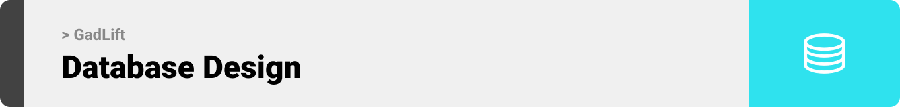

<br><br>

<!-- project philosophy -->


## **GadLift**: Elevating Convenience to New Heights

>Imagine a world where your home gadgets come to you, effortlessly and on-demand. Especially in buildings without elevators, this can be a game-changer. That's where **GadLift** steps in. 

>**GadLift** is an innovative IoT system designed to simplify your life by bringing your home gadgets right to your doorstep. Our mission is to make your life easier, one lift at a time.

## User Stories

### User

- **Effortless Living**: As a user, I want a device that lifts my gadgets to my doorstep, so I can relax and enjoy my home without the heavy lifting.
- **Family Access**: As a user, I want to register family members on the app, enabling everyone in my family to use the device and share in the convenience.
- **App Control**: As a user, I want to call the device using a mobile app, eliminating the need for a physical remote control and making the process seamless.

### Admin

- **User Analytics**: As an admin, I want to see how many users are using the app, enabling me to manage the app's scalability effectively.
- **Device Tracking**: As an admin, I want to see how many devices I have, allowing me to keep track of all active devices.
- **Platform Expansion**: As an admin, I want to add a new device to the platform, helping me monitor the number of active and offline devices.

>
> With **GadLift**, we're not just lifting gadgets - we're elevating your home living experience. Welcome to a world of convenience, welcome to **GadLift**. 🚀

<br><br>

<!-- Tech Stacks -->


###  **GadLift**  is built using the following technologies:

- This project uses the [Flutter app development framework](https://flutter.dev/). Flutter is a cross-platform hybrid app development platform which allows us to use a single codebase for apps on different platforms including mobile, desktop, Linux, Android, IOS,MacOs, Windows and the web.
- The admin panel is done using [React.js](https://react.dev/). React.js is a JavaScript library for building single-page applications out of individual pieces called components.
- To send  notifications, the app uses the [firebase_messaging ](https://pub.dev/packages/firebase_messaging) package which supports Android, iOS.

- For the backend side the project done with [NestJS](https://nestjs.com/)
which is a progressive Node.js framework that helps build server-side applications. Nest extends [Node.js](https://nodejs.org/en) frameworks like Express or Fastify adding modular organization and a wide range of other libraries to take care of repetitive tasks. It’s open-source, uses [TypeScript](https://www.typescriptlang.org/), and it is a very versatile Node.js framework for building backend systems. It helps scale Node.js servers and supports several databases.

- The project uses [MongoDB](https://www.mongodb.com/). Which is an open-source, nonrelational database management system (DBMS) that uses flexible, JSON-like documents instead of traditional tables and rows to process and store various forms of data12. As a NoSQL database solution, MongoDB provides an elastic data storage model that enables users to store and query multivariate data types with ease.

- For the IOT part the project uses [PlatformIO](https://platformio.org/) which is is a professional, cross-platform tool for embedded systems engineers and software developers1. It supports multiple frameworks and is compatible with a wide range of microcontroller boards, including Arduino and other MCU boards.
  
- The app uses the font [Zen Dots](https://fonts.google.com/specimen/Zen+Dots) as its main font, and the design of the app adheres to the material design guidelines.

<br><br>

> We designed GadLift app using wireframes and mockups, iterating on the design until we reached the ideal layout for easy navigation and a seamless user experience.
- Project Figma design [figma](https://www.figma.com/file/fP5bB9WHHoilZjojs0GYy6/GadLift?type=design&node-id=0%3A1&mode=design&t=P8N8zA6ovk7ayPJw-1)

### Mockups
| Login screen  | Register screen |  On boarding screen |
| ---| ---| ---|
|  |  |  |


<br><br>

<!-- db -->



###  Architecting Data Excellence: Innovative Database Design Strategies:

- Insert ER Diagram here


<br><br>

### User Screens (Mobile)
| Login screen  | Register screen | Landing screen | Loading screen |
| ---| ---| ---| ---|
|  |  |  |  |
| Home screen  | Menu Screen | Order Screen | Checkout Screen |
|  |  |  |  |

### Admin Screens (Web)
| Login screen  | Dashboard screen |  Landing screen |
| ---| ---| ---|
|  |  |  |
<!-- | Home screen  | Menu Screen | Order Screen |
|  |  |  | -->

<br><br>

<!-- Tech stack -->


###  Architecting Data Excellence: Innovative Database Design Strategies:

- Insert ER Diagram here


<br><br>


<!-- Implementation -->


### User Screens (Mobile)
| Login screen  | Register screen | Landing screen | Loading screen |
| ---| ---| ---| ---|
|  |  |  |  |
| Home screen  | Menu Screen | Order Screen | Checkout Screen |
|  |  |  |  |

### Admin Screens (Web)
| Login screen  | Register screen |  Landing screen |
| ---| ---| ---|
|  |  |  |
| Home screen  | Menu Screen | Order Screen |
|  |  |  |

<br><br>


<!-- AWS Deployment -->


###  Efficient AI Deployment: Unleashing the Potential with AWS Integration:

- This project leverages AWS deployment strategies to seamlessly integrate and deploy natural language processing models. With a focus on scalability, reliability, and performance, we ensure that AI applications powered by these models deliver robust and responsive solutions for diverse use cases.

<br><br>

<!-- Unit Testing -->


###  Precision in Development: Harnessing the Power of Unit Testing:

- This project employs rigorous unit testing methodologies to ensure the reliability and accuracy of code components. By systematically evaluating individual units of the software, we guarantee a robust foundation, identifying and addressing potential issues early in the development process.

<br><br>


> To set up GadLift locally, follow these steps:

### Prerequisites

This is an example of how to list things you need to use the software and how to install them.
* npm
  ```sh
  npm install npm@latest -g
  ```

### Installation

<!-- _Below is an example of how you can instruct your audience on installing and setting up your app. This template doesn't rely on any external dependencies or services._ -->

1. Get a free API Key at [https://example.com](https://example.com)
2. Clone the repo
   ```sh
   git clone https://github.com/younes-damouna/gad-lift.git
   ```
3. Install NPM packages
   ```sh
   npm install
   ```
4. Enter your API in `env.example`
   - rename `env.example` to `env`

   ```js
   const API_KEY = 'ENTER YOUR API';
   ```

Now, you should be able to run GadLift locally and explore its features.